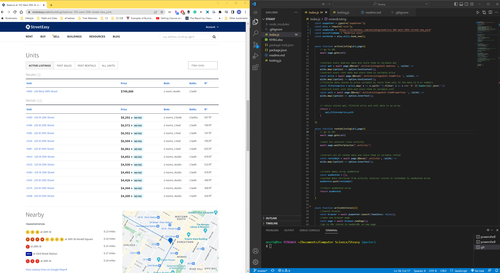

# Project STEASY
 
The Challenge: To automate laborious process of manually extracting rental transactions from Streeteasy.
The Solution: Project STEASY - webscraping application

# Impact

DEDM team tracks NYC rental market data of 200+ rental buildings to create customize market reports. By utilizing this application, we have improved our turnaround time to publish reports by 44%. 

# How it's Made: 

For the purpose of simplicity, Puppeteer, a Node.js Library is used to scrap rental transactions from desirable streeteasy building URL.

# Sample

# Installation Packages and Dependencies
- `Fork/Clone this repo (https://github.com/moethantkoko/Steasy.git) `
- `npm install`

# User Instructions
- navigate to index.js
- update "newDevURL" variable to desirable streeteasy building URL
- update "excelFileName variable to desirable excel file name. Be sure it's a string with .xlsx"
- Run "node index.js" in your terminal

# Limitation
- This app is to run one building profile at a time to overcome server detection. 
